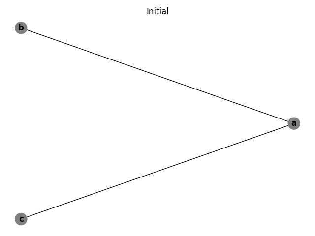
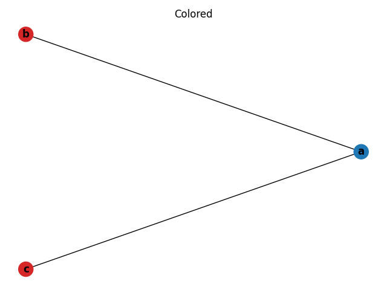
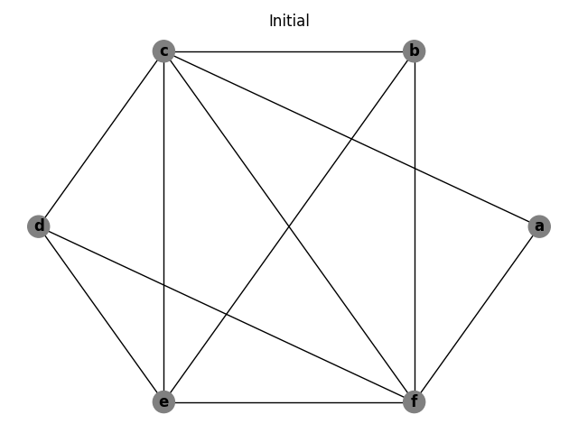
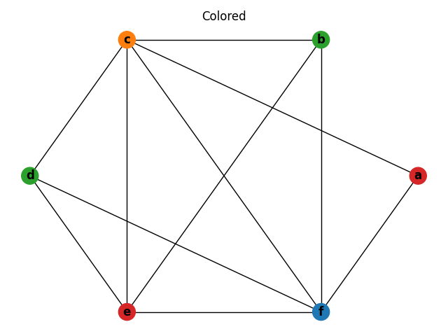

# Register Allocation and Spilling via Graph Coloring

## Register Allocation
Variables in a program can be stored in either main memory or in registers. Accessing a variable stored in a register is significantly faster than accessing a variable in main memory. Therefore, it is the goal of the compiler to assign as many variables to registers as possible. This assignment process is known as register allocation.

The challenge of register allocation is that a CPU has a limited number of general purpose registers that can be used to store variables. If two variables are alive simultaneously, they cannot share the same register. However, if their lifetimes do not overlap, they can be allocated to the same register. For the compiler to produce performant code, it must analyze the lifetimes of variables and assign them to registers accordingly.

The predominant approach to analyzing variable lifetimes and allocating registers is through graph coloring. In this approach, nodes in the graph represent variables and edges represent live range conflicts. This graph is known as an interference graph. The colors used to color the graph represent registers. If a CPU has _k_ general purpose registers available to store variables, the goal would be to _k_-color the graph. However, for some graphs a _k_-coloring is not possible and variables must be “spilled” to main memory until the graph is _k_-colorable. By spilling variables to main memory, the live range conflicts can be eliminated. 

## Overview of Chaitin's algorithm
* Broad overview of Chaitin's algorithm. 
* Describe steps of algorithm.
* Discuss graph coloring heuristic.

## Basic Example
* Discussion of simple example that is easily colorable.
* Discuss liveness.
* Discuss intermediate language and how it maps to simple code example.

```
                {a}
b = a + 2
                {a, b}
c = b * b
                {a, c}
b = c + 1
                {a, b}
return b * a
```





## Subsumption Example
* Discussion of subsumption.
* Example where unnecessary copy operations are eliminated.

```
                {a}
b = a + 2
                {a, b}
c = b * b
                {a, c}
d = c
                {a, d}
b = d + 1
                {a, b}
return b * a
```


## Multiple Building Blocks
* Discussion of larger example with multiple building blocks.





## Spilling
* Take same example as in multiple building blocks, but reduce available colors to force spilling registers.
* Discussion of spilling.


### Frequency Optimization
* Explain motivation of frequency optimization to selecting which symbol to spill.
* Discussion of spilling algorithm.
* Simple example demonstrating how building block frequencies change which symbol is spilled.

## Improvements (__If above content is too sparse__)
* Discussion of improvements introduced by Briggs et al. Implementation focused on Chaitin's algorithm so this discussion will not have examples.

## Running locally
* Instructions on running locally

## Resources
* Chaitin paper
  * https://cs.gmu.edu/~white/CS640/p98-chaitin.pdf
* Slides on Chaitin's algorithm
  * http://kodu.ut.ee/~varmo/TM2010/slides/tm-reg.pdf
* More slides on Chaitin's algorithm, contains example with multiple building blocks
  * http://web.cecs.pdx.edu/~mperkows/temp/register-allocation.pdf
* Set Theoretic Language (SETL) introduction
  * https://www.sciencedirect.com/science/article/pii/0898122175900115
* Briggs et al. paper
  * http://www.cs.utexas.edu/users/mckinley/380C/lecs/briggs-thesis-1992.pdf
* Python graph drawing package
  * https://networkx.github.io/
