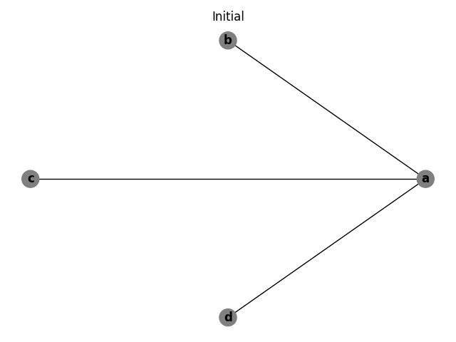
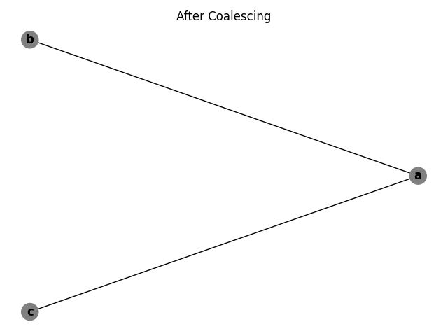
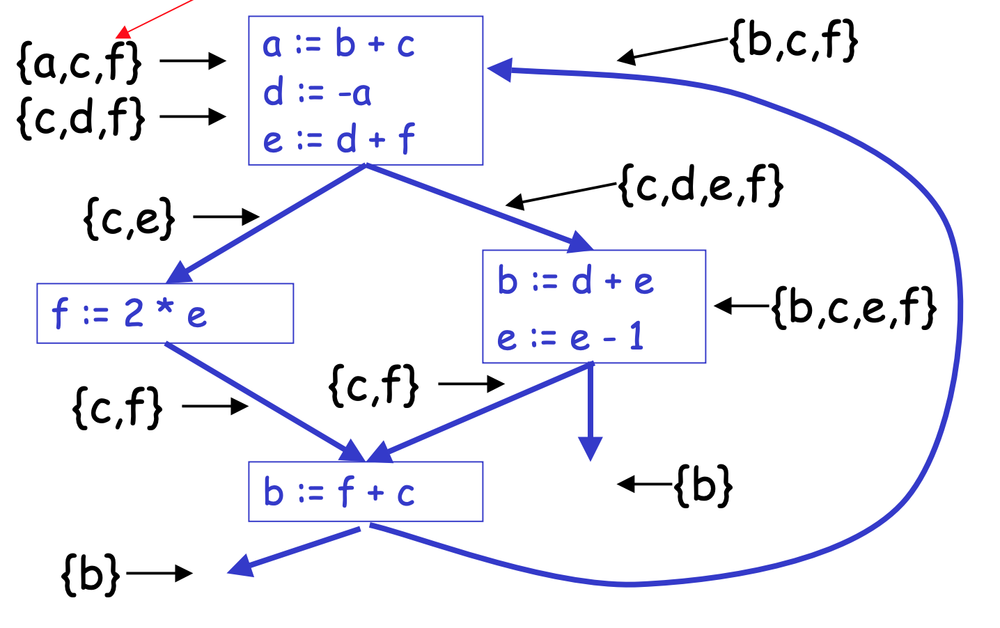

# Register Allocation and Spilling via Graph Coloring

## Register Allocation
Variables in a program can be stored in either main memory or in registers. Accessing a variable stored in a register is significantly faster than accessing a variable in main memory. Therefore, it is the goal of the compiler to assign as many variables to registers as possible. This assignment process is known as register allocation.

The challenge of register allocation is that a CPU has a limited number of general purpose registers that can be used to store variables. If two variables are alive simultaneously, they cannot share the same register. However, if their lifetimes do not overlap, they can be allocated to the same register. For the compiler to produce performant code, it must analyze the lifetimes of variables and assign them to registers accordingly.

The predominant approach to analyzing variable lifetimes and allocating registers is through graph coloring. In this approach, nodes in the graph represent variables and edges represent live range conflicts. This graph is known as an interference graph. The colors used to color the graph represent registers. If a CPU has _k_ general purpose registers available to store variables, the goal would be to _k_-color the graph. However, for some graphs a _k_-coloring is not possible and variables must be “spilled” to main memory until the graph is _k_-colorable. By spilling variables to main memory, the live range conflicts can be eliminated. 

## Overview of Chaitin's algorithm

In the paper Register Allocation and Spilling via Graph Coloring [1], Chaitin proposed an algorithm to take the intermediate language of a compiler and perform register allocation. The main parts of the algorithm are “building the interference graph, coalescing the nodes, attempting to find a 32-coloring of the graph, and if one cannot be found, modifying the program and its graph until a 32-coloring is obtained.” The algorithm in the paper is written in SETL [2] which was translated into Python as part of this project. Below are explanations of each step in the algorithm accompanied by graphs generated by the Python implementation.

## Basic Example

First, we will discuss a simple example that uses few variables and registers. Below is a simple section of code, on the left is the code and on the right is the live set at each step of the code [3].

At the beginning of the code, a variable _a_ is alive. Then _a_ is used to compute a new variable, _b_, which enters the live set. _b_ is used to compute another new variable, _c_, which also enters the live set. Because this is the last time this instance of _b_ is used, _b_ exits the live set. Then a new instance of _b_ is created using _c_. _c_ is not used again so it exits the live set. At the end we are left with _a_ and _b_ in the live set.

```
                {a}
b = a + 2
                {a, b}
c = b * b
                {a, c}
b = c + 1
                {a, b}
return b * a
```

Chaitin's algorithm is designed to take an intermediate language as input rather than high-level code. The intermediate language indicates when variables are defined, when they are are used, and whether they are dead or alive.

In this Python implementation of Chaitin's algorithm, the above code can be represented by the following intermediate language.

```
IntermediateLanguage([
    Instruction(
        'bb',
        [Dec('a', False)],
        []),
    Instruction(
        'b = a + 2',
        [Dec('b', False)],
        [Use('a', False)]
    ),
    Instruction(
        'c = b * b',
        [Dec('c', False)],
        [Use('b', True)]
    ),
    Instruction(
        'b = c + 1',
        [Dec('b', False)],
        [Use('c', True)]
    ),
    Instruction(
        'return b * a',
        [],
        [Use('a', True), Use('b', True)]
    )
])
```

The code and intermediate language can be represented by the following graph. The graph has an edge connecting _a_ to _b_ and _a_ to _c_ which is expected based on the live set.


This graph can easily be 2-colored, indicating two registers are required to execute the code.


## Subsumption Example

After building the interference graph, the next stop of the algorithm is to eliminate unnecessary register copy operations. This is done by coalescing or combining the nodes which are the source and targets of a copy operation.

The previous example can be modified to add a new variable, _d_, which is a copy of _c_. _d_ is then used in place of _c_ in the remainder of the example. When the initial interference graph is built, it shows that there is interference between _a_ and _b_, _a_ and _c_, and _a_ and _d_. 

```
                {a}
b = a + 2
                {a, b}
c = b * b
                {a, c}
d = c
                {a, d}
b = d + 1
                {a, b}
return b * a
```



However, in the coalescing phase, the algorithm identifies the copy from _c_ to _d_ and replaces references of _d_ with _c_. The graph now matches the previous example which has already been shown to be 2-colorable by the algorithm.




## Multiple Basic Blocks

Chaitin's register allocation example can be applied to programs with multiple basic blocks as well. Although this example is larger and more complex than the previous examples, the basic steps still apply [4]. The algorithm computes the interference graph, checks for unnecessary copy operations, and colors the graph.




One of the inputs to the algorithm are the colors (registers) available, so as long as 4 colors are available to color this graph, no additional steps are necessary as the graph is 4-colorable.


## Spilling
* Take same example as in multiple building blocks, but reduce available colors to force spilling registers.
* Discussion of spilling.


### Frequency Optimization
* Explain motivation of frequency optimization to selecting which symbol to spill.
* Discussion of spilling algorithm.
* Simple example demonstrating how building block frequencies change which symbol is spilled.

## Improvements (__If above content is too sparse__)
* Discussion of improvements introduced by Briggs et al. Implementation focused on Chaitin's algorithm so this discussion will not have examples.

## Running locally
* Instructions on running locally

## Resources
* Chaitin paper
  * https://cs.gmu.edu/~white/CS640/p98-chaitin.pdf
* Slides on Chaitin's algorithm
  * http://kodu.ut.ee/~varmo/TM2010/slides/tm-reg.pdf
* More slides on Chaitin's algorithm, contains example with multiple building blocks
  * http://web.cecs.pdx.edu/~mperkows/temp/register-allocation.pdf
* Set Theoretic Language (SETL) introduction
  * https://www.sciencedirect.com/science/article/pii/0898122175900115
* Briggs et al. paper
  * http://www.cs.utexas.edu/users/mckinley/380C/lecs/briggs-thesis-1992.pdf
* Python graph drawing package
  * https://networkx.github.io/
