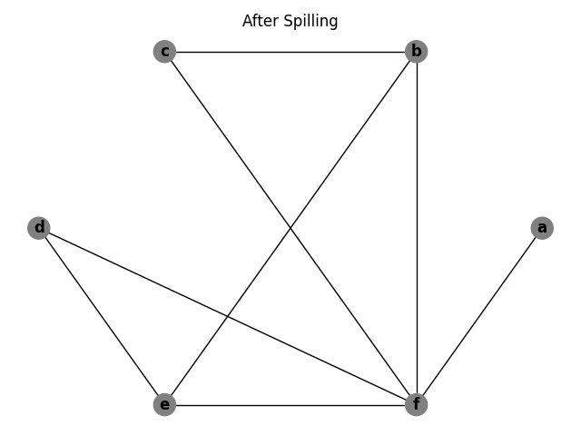
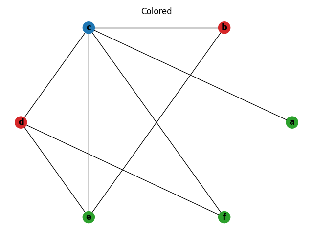

# Register Allocation and Spilling via Graph Coloring

## Register Allocation
Variables in a program can be stored in either main memory or in registers. Accessing a variable stored in a register is significantly faster than accessing a variable in main memory. Therefore, it is the goal of the compiler to assign as many variables to registers as possible. This assignment process is known as register allocation.

The challenge of register allocation is that a CPU has a limited number of general purpose registers that can be used to store variables. If two variables are alive simultaneously, they cannot share the same register. However, if their lifetimes do not overlap, they can be allocated to the same register. For the compiler to produce performant code, it must analyze the lifetimes of variables and assign them to registers accordingly.

The predominant approach to analyzing variable lifetimes and allocating registers is through graph coloring. In this approach, nodes in the graph represent variables and edges represent live range conflicts. This graph is known as an interference graph. The colors used to color the graph represent registers. If a CPU has _k_ general purpose registers available to store variables, the goal would be to color the graph with k or fewer colors. However, for some graphs, a _k_-coloring is not possible and variables must be “spilled” to main memory until the graph is _k_-colorable. By spilling variables to main memory, the live range conflicts can be eliminated. 

## Overview of Chaitin's algorithm

In the paper _Register Allocation and Spilling via Graph Coloring_ [1], Gregory Chaitin proposed an algorithm to take the intermediate language of a compiler and perform register allocation using graph coloring. The main parts of the algorithm are “building the interference graph, coalescing the nodes, attempting to find a 32-coloring of the graph, and if one cannot be found, modifying the program and its graph until a 32-coloring is obtained.” The paper often refers to 32-coloring because the CPU Chaitin was using had thirty-two 32-bit general purpose registers. However, the algorithm is generalizable to other numbers of registers.

The algorithm in the paper is written in SETL [2] which was translated into Python as part of this project. [The Python implementation can be found here](register_allocation.py). Below are explanations of each step in the algorithm accompanied by graphs generated by the Python implementation.

## Basic Example

First, we will discuss a simple example that uses few variables and registers. Below is a simple section of code, on the left is the code and on the right is the live set at each step of the code [3].

At the beginning of the code, a variable _a_ is alive. Then _a_ is used to compute a new variable, _b_, which enters the live set. _b_ is used to compute another new variable, _c_, which also enters the live set. Because this is the last time this instance of _b_ is used, _b_ exits the live set. Then a new instance of _b_ is created using _c_. _c_ is not used again so it exits the live set. At the end we are left with _a_ and _b_ in the live set.

```
                {a}
b = a + 2
                {a, b}
c = b * b
                {a, c}
b = c + 1
                {a, b}
return b * a
```

Chaitin's algorithm is designed to take an intermediate language as input rather than high-level code. The intermediate language indicates when variables are defined, when they are are used, and whether they are dead or alive.

In this Python implementation of Chaitin's algorithm, the above code can be represented to the following intermediate language.

```
IntermediateLanguage([
    Instruction(
        'bb',
        [Dec('a', False)],
        []),
    Instruction(
        'b = a + 2',
        [Dec('b', False)],
        [Use('a', False)]
    ),
    Instruction(
        'c = b * b',
        [Dec('c', False)],
        [Use('b', True)]
    ),
    Instruction(
        'b = c + 1',
        [Dec('b', False)],
        [Use('c', True)]
    ),
    Instruction(
        'return b * a',
        [],
        [Use('a', True), Use('b', True)]
    )
])
```

The code and intermediate language can be represented by the following graph. The graph has an edge connecting _a_ to _b_ and _a_ to _c_ which is expected based on the live set.


This graph can be 2-colored, indicating two registers are required to execute the code.


## Subsumption Example

After building the interference graph, the next step of the algorithm is to eliminate unnecessary register copy operations. This is done by coalescing or combining the nodes which are the source and targets of copy operations.

The previous example can be modified to add a new variable, _d_, which is a copy of _c_. _d_ is then used in place of _c_ in the remainder of the example. When the initial interference graph is built, it shows that there is interference between _a_ and _b_, _a_ and _c_, and _a_ and _d_. 

```
                {a}
b = a + 2
                {a, b}
c = b * b
                {a, c}
d = c
                {a, d}
b = d + 1
                {a, b}
return b * a
```


However, in the coalescing phase, the algorithm identifies the copy from _c_ to _d_ and replaces references of _d_ with _c_. The graph now matches the previous example which has already been shown to be 2-colorable by the algorithm.


## Multiple Basic Blocks

Chaitin's register allocation example can be applied to programs with multiple basic blocks as well. Although this example is larger and more complex than the previous examples, the same steps still apply [4]. The algorithm computes the interference graph, checks for unnecessary copy operations, and colors the graph.


The above diagram was taken from M. Perkowski's slides [4].


One of the inputs to the algorithm are the colors (registers) available, so as long as four colors are available to color the graph, no additional steps are necessary because the graph is 4-colorable.


## Spilling

The previous example did not require any additional steps beyond what the basic example used because enough colors were available to color the graph without any changes. But what happens if only three colors are available instead of four?

The graph coloring algorithm will not be able find a way to 3-color the graph in its current form and will return an undefined result. At this point the algorithm will have to spill at least one variable to main memory. Determining which variable to spill is a multi-step process.

First, the algorithm computes a cost estimate of each variable. This cost estimate is equal to "the number of definition points plus the number of uses of that computation, where each definition and use is weighted by its estimated execution frequency [1]." The frequency is provided as an input into the algorithm for each basic block.

After computing the cost estimates, the algorithm will pick which variables to spill based on their costs and insert the instructions to spill the chosen variables into the intermediate language. The algorithm will then rebuild the interference graph, check for unnecessary copy operations, and attempt to color the graph again. Typically only one round of spilling is required, but Chaitin mentions that "it is sometimes necessary to loop through this process yet again, adding a little more spill code, until a 32-coloring is finally obtained [1]."

Below is the interference graph of the multiple building block example.


If we change the number of available registers from four to three, the graph is no longer colorable and at least one spill will be required.

Because this example is not based on an actual program, the frequencies for each basic block can be assigned arbitrarily. For this example, we assign the top basic block a frequency of 1, the left basic block a frequency of 0.75, the right basic block a frequency of 0.25, and the bottom basic block a frequency of 1. These frequencies result in the following cost estimates:

```
{
    'a': 2,
    'b': 2.25,
    'c': 2,
    'd': 2.25,
    'e': 2.25,
    'f': 2.75
}
```

After computing these costs, the algorithm determines which symbols to spill. It first finds all the symbols in the intermediate langauge and removes any symbols from the interference graph that have a degree less than the number of colors available. Once it runs out of symbols to remove, it chooses the least costly symbol, adds it to the spill list, and removes it from the graph. This process continues until all symbols have been processed.

_a_ and _c_ are the two least costly variables in the example but _a_ has a degree less than the number of colors, so spilling it is not necessary. Therefore, _c_ is spilled.

Below is the interference graph after spilling _c_.



Now after spilling _c_, the graph is 3-colorable.


### Frequency Optimization

If we adjust the frequencies so that _f_ is the least costly symbol, the algorithm will decide to spill _f_.


After spilling _f_, the graph is 3-colorable.



## Resources

1. G. Chaitin. 2004. Register allocation and spilling via graph coloring. SIGPLAN Not. 39, 4 (April 2004), 66–74. DOI:https://doi.org/10.1145/989393.989403
    1. Paper also available here: https://cs.gmu.edu/~white/CS640/p98-chaitin.pdf
2. K. Kennedy, J. Schwartz. 1975. An introduction to the set theoretical language SETL. Computers & Mathematics with Applications. Volume 1, Issue 1,, 97-119. DOI:https://doi.org/10.1016/0898-1221(75)90011-5.
3. V Vene. 2010. Register allocation. http://kodu.ut.ee/~varmo/TM2010/slides/tm-reg.pdf
4. M. Perkowski. 2001. Register allocation (via graph coloring). http://web.cecs.pdx.edu/~mperkows/temp/register-allocation.pdf

## Packages used
* [networkx](https://networkx.github.io/)
* [matplotlib](https://matplotlib.org/)
