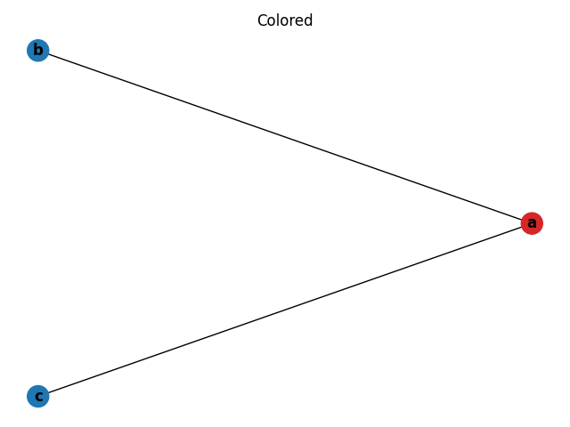
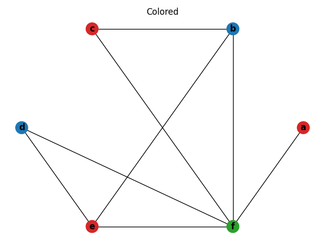

# Register Allocation and Spilling via Graph Coloring

## Register Allocation
* Define basic compiler terminology required.
* Explain motivation for register allocation.
* Explain how graph coloring concept maps to register allocation.

## Overview of Chaitin's algorithm
* Broad overview of Chaitin's algorithm. 
* Describe steps of algorithm.
* Discuss graph coloring heuristic.

## Basic Example
* Discussion of simple example that is easily colorable.
* Discuss liveness.
* Discuss intermediate language and how it maps to simple code example.

```
                {a}
b = a + 2
                {a, b}
c = b * b
                {a, c}
b = c + 1
                {a, b}
return b * a
```


## Subsumption Example
* Discussion of subsumption.
* Example where unnecessary copy operations are eliminated.

```
                {a}
b = a + 2
                {a, b}
c = b * b
                {a, c}
d = c
                {a, d}
b = d + 1
                {a, b}
return b * a
```




## Multiple Building Blocks
* Discussion of larger example with multiple building blocks.


## Spilling
* Take same example as in multiple building blocks, but reduce available colors to force spilling registers.
* Discussion of spilling.




### Frequency Optimization
* Explain motivation of frequency optimization to selecting which symbol to spill.
* Discussion of spilling algorithm.
* Simple example demonstrating how building block frequencies change which symbol is spilled.

## Improvements (__If above content is too sparse__)
* Discussion of improvements introduced by Briggs et al. Implementation focused on Chaitin's algorithm so this discussion will not have examples.

## Running locally
* Instructions on running locally

## Resources
* Chaitin paper
  * https://cs.gmu.edu/~white/CS640/p98-chaitin.pdf
* Slides on Chaitin's algorithm
  * http://kodu.ut.ee/~varmo/TM2010/slides/tm-reg.pdf
* More slides on Chaitin's algorithm, contains example with multiple building blocks
  * http://web.cecs.pdx.edu/~mperkows/temp/register-allocation.pdf
* Set Theoretic Language (SETL) introduction
  * https://www.sciencedirect.com/science/article/pii/0898122175900115
* Briggs et al. paper
  * http://www.cs.utexas.edu/users/mckinley/380C/lecs/briggs-thesis-1992.pdf
* Python graph drawing package
  * https://networkx.github.io/
